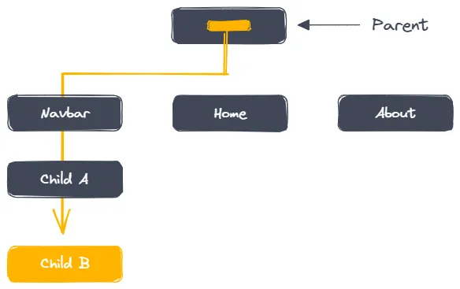
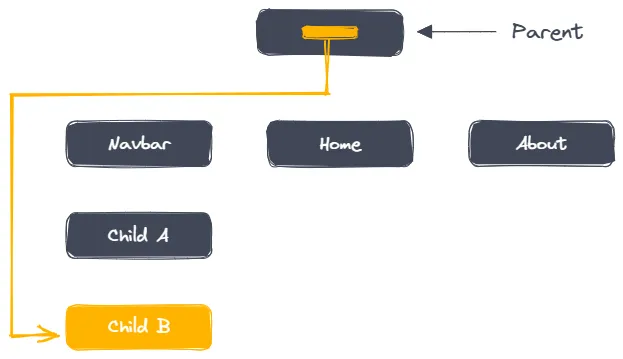

State Management dengan Context API #ReactJS_5

Pengantar
State management adalah konsep penting dalam pengembangan aplikasi React. Ketika aplikasi Anda berkembang, mengelola state menjadi lebih kompleks, terutama ketika banyak komponen memerlukan akses ke state yang sama. Context API di React adalah solusi untuk masalah ini. Context API memungkinkan Anda berbagi state global di seluruh komponen tanpa harus meneruskan props secara manual di setiap tingkatan komponen.

1. Apa itu Context API?
Context API adalah fitur bawaan React yang memungkinkan Anda membuat “context” yang dapat diakses oleh banyak komponen tanpa harus meneruskan props secara eksplisit di setiap tingkatan. Ini sangat berguna untuk state global seperti tema aplikasi, informasi pengguna yang masuk, atau pengaturan preferensi.

2. Membuat dan Menggunakan Context
Berikut adalah langkah-langkah untuk menggunakan Context API:

Membuat Context
Menyediakan (Provide) Context
Menggunakan (Consume) Context
2.1 Membuat Context
Langkah pertama adalah membuat context menggunakan React.createContext().

import React, { createContext, useState } from 'react';

// Membuat Context dengan nilai awal (optional)
const ThemeContext = createContext(); 

export default ThemeContext;
Penjelasan:

createContext() membuat objek context yang dapat digunakan untuk menyediakan dan mengkonsumsi nilai di dalam komponen React.
2.2 Menyediakan (Provide) Context
Langkah kedua adalah menyediakan context menggunakan Context.Provider di sekitar komponen yang membutuhkan akses ke state tersebut.

import React, { useState } from 'react';
import ThemeContext from './ThemeContext';
import ThemedComponent from './ThemedComponent';

function App() {
  // Mengelola state tema dengan useState
  const [theme, setTheme] = useState('light');

  // Fungsi untuk mengganti tema
  const toggleTheme = () => {
    setTheme(theme === 'light' ? 'dark' : 'light');
  };

  return (
    // Menggunakan ThemeContext.Provider untuk menyediakan nilai context
    <ThemeContext.Provider value={{ theme, toggleTheme }}>
      <ThemedComponent />
    </ThemeContext.Provider>
  );
}

export default App;
Penjelasan:

ThemeContext.Provider menyediakan nilai context (value={{ theme, toggleTheme }}) kepada semua komponen yang berada di dalam Provider.
State theme dan fungsi toggleTheme disediakan sebagai nilai context yang dapat diakses oleh komponen-komponen anak.
2.3 Menggunakan (Consume) Context
Langkah terakhir adalah menggunakan context di komponen lain yang membutuhkan akses ke state global ini.

import React, { useContext } from 'react';
import ThemeContext from './ThemeContext';

function ThemedComponent() {
  // Menggunakan useContext untuk mengakses nilai context
  const { theme, toggleTheme } = useContext(ThemeContext);

  // Menentukan gaya berdasarkan nilai context
  const style = {
    backgroundColor: theme === 'light' ? '#fff' : '#333',
    color: theme === 'light' ? '#000' : '#fff',
    padding: '10px',
    textAlign: 'center'
  };

  return (
    

      Tema saat ini: {theme}
      {/* Tombol untuk mengganti tema */}
      <button onClick={toggleTheme}>Ganti Tema</button>
    

  );
}

export default ThemedComponent;
Penjelasan:

useContext(ThemeContext) digunakan untuk mengakses nilai context yang disediakan oleh ThemeContext.Provider.
Komponen ThemedComponent menggunakan nilai context untuk menentukan gaya (light/dark) dan menyediakan tombol untuk mengganti tema.
3. Memisahkan Context dalam File Tersendiri
Untuk struktur yang lebih rapi, seringkali context dipisahkan ke dalam file tersendiri. Berikut adalah contoh bagaimana Anda dapat memisahkan context dalam file yang berbeda.

ThemeContext.js:

import React, { createContext, useState } from 'react';

// Membuat dan mengekspor ThemeContext
const ThemeContext = createContext();

export function ThemeProvider({ children }) {
  const [theme, setTheme] = useState('light');

  // Fungsi untuk mengganti tema
  const toggleTheme = () => {
    setTheme(theme === 'light' ? 'dark' : 'light');
  };

  return (
    // Menggunakan ThemeContext.Provider untuk menyediakan nilai context
    <ThemeContext.Provider value={{ theme, toggleTheme }}>
      {children}
    </ThemeContext.Provider>
  );
}

export default ThemeContext;
App.js:

import React from 'react';
import { ThemeProvider } from './ThemeContext';
import ThemedComponent from './ThemedComponent';

function App() {
  return (
    // Menggunakan ThemeProvider untuk menyediakan context
    <ThemeProvider>
      <ThemedComponent />
    </ThemeProvider>
  );
}

export default App;
Penjelasan:

Context dan provider dipisahkan ke dalam file ThemeContext.js.
ThemeProvider adalah komponen pembungkus yang menyimpan state tema dan menyediakan context kepada komponen anak.
Komponen App menggunakan ThemeProvider untuk membungkus ThemedComponent, sehingga memberikan akses ke context.
4. Context dan useReducer
Kadang-kadang, Anda mungkin perlu mengelola state yang lebih kompleks di dalam context, dan di sinilah useReducer bisa digunakan bersama Context API.

Contoh:

CounterContext.js:

import React, { createContext, useReducer } from 'react';

// Membuat context untuk counter
const CounterContext = createContext();

// Fungsi reducer untuk mengelola state counter
function counterReducer(state, action) {
  switch (action.type) {
    case 'increment':
      return { count: state.count + 1 };
    case 'decrement':
      return { count: state.count - 1 };
    default:
      throw new Error(`Unhandled action type: ${action.type}`);
  }
}

// Provider untuk menyediakan state dan dispatch kepada komponen anak
export function CounterProvider({ children }) {
  const [state, dispatch] = useReducer(counterReducer, { count: 0 });

  return (
    <CounterContext.Provider value={{ state, dispatch }}>
      {children}
    </CounterContext.Provider>
  );
}

export default CounterContext;
CounterComponent.js:

import React, { useContext } from 'react';
import CounterContext from './CounterContext';

function CounterComponent() {
  // Menggunakan useContext untuk mengakses state dan dispatch dari context
  const { state, dispatch } = useContext(CounterContext);

  return (
    

      <h1>Counter: {state.count}</h1>
      <button onClick={() => dispatch({ type: 'increment' })}>Increment</button>
      <button onClick={() => dispatch({ type: 'decrement' })}>Decrement</button>
    

  );
}

export default CounterComponent;
Penjelasan:

CounterContext digunakan untuk menyediakan state dan fungsi dispatch untuk mengelola state dengan useReducer.
counterReducer adalah fungsi reducer yang menangani aksi increment dan decrement.
CounterComponent menggunakan useContext untuk mengakses state counter dan dispatch aksi untuk mengubah state.
Kesimpulan
Context API adalah alat yang sangat berguna untuk mengelola state global dalam aplikasi React. Dengan memisahkan state yang sering digunakan ke dalam context, Anda dapat membuat aplikasi yang lebih terorganisir dan lebih mudah dikelola. Menggunakan Context API bersama dengan useReducer juga memungkinkan Anda untuk mengelola state yang lebih kompleks dengan mudah.

Latihan
1. Membuat Tema Global: Buatlah aplikasi yang memungkinkan pengguna untuk beralih antara tema terang dan gelap menggunakan Context API.
2. State Global Pengguna: Implementasikan Context API untuk mengelola state pengguna yang login, dan tampilkan informasi pengguna di komponen yang berbeda.
3. Counter dengan Context dan Reducer: Kembangkan contoh di atas dengan menambahkan fitur reset ke counter menggunakan useReducer.

Dengan mengerjakan latihan ini, Anda akan semakin memahami cara menggunakan Context API dalam berbagai situasi untuk mengelola state dalam aplikasi React.